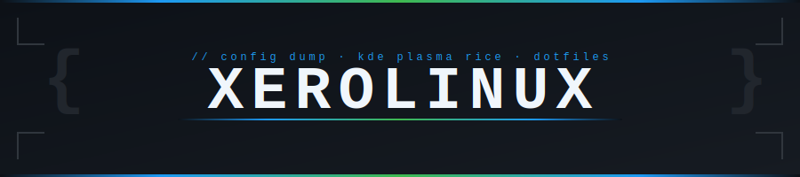

<!-- HEADER -->

  

<!-- SYSTEM BADGES -->

&nbsp;

&nbsp;

&nbsp;

 

---

<!-- CODE EDITOR SPECS CARD -->

 

---

<!-- FUNDRAISER -->

  

&nbsp;

 

---

<!-- SOCIAL -->

&nbsp;

&nbsp;

 

 

---
